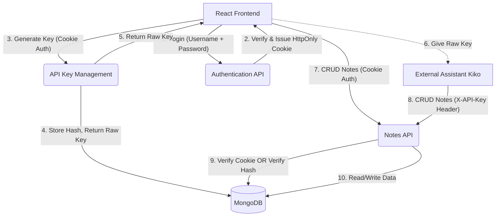

# Notes-Web API Internals & Architecture

This document serves as the comprehensive engineering specification for the `notes-web` backend. The architecture follows a strict Separation of Concerns (SoC) principle, decoupling routing, business logic, and data access into distinct layers.

## 1. System Architecture

The backend is built using **Node.js, Express, and MongoDB (via Mongoose)**. 

### Data Flow Diagram (DFD)
Below is the Data Flow Diagram illustrating how external entities (the React Client and the external Assistant Kiko) interact with the system.



### Directory Structure (Separation of Concerns)

```text
backend/
├── config/
│   └── db.js                 # MongoDB connection logic
├── controllers/
│   ├── authController.js     # Login/Register logic
│   ├── apiKeyController.js   # Key generation and revocation logic
│   └── noteController.js     # CRUD operations for notes
├── middleware/
│   └── authMiddleware.js     # JWT Cookie and API Key verification
├── models/
│   ├── User.js               # User schema (Username, Password hash)
│   ├── ApiKey.js             # API Key schema (Hash, Name, User ref)
│   └── Note.js               # Note schema (Content, User ref)
├── routes/
│   ├── authRoutes.js         # Routes to authController
│   ├── apiKeyRoutes.js       # Routes to apiKeyController
│   └── noteRoutes.js         # Routes to noteController
├── .env                      # Secrets (JWT_SECRET, MONGO_URI)
├── swagger.yaml              # OpenAPI Specification
└── server.js                 # Express bootstrap and middleware mounting
```

## 2. Authentication Mechanisms

The API supports two mutually exclusive authentication mechanisms to accommodate both the browser (Frontend) and programmatic access (Kiko).

### A. First-Party Auth: HttpOnly JWT Cookies (Browser)
To prevent Cross-Site Scripting (XSS) attacks, the frontend NEVER touches the JWT. 
1. **Login**: User sends `username` and `password`.
2. **Issue**: Server validates against the Argon2id/Bcrypt hash in MongoDB. Server signs a JWT and attaches it to the response as an `HttpOnly`, `Secure`, `SameSite=Strict` cookie.
3. **Verify**: The `authMiddleware.protect` function reads the cookie directly from the incoming request. If valid, it attaches `req.user` and allows the request to proceed.

### B. Third-Party Auth: Hashed API Keys (Kiko)
To securely allow Kiko to access the API without complex OAuth flows:
1. **Generate**: User requests a key via the frontend. Server generates 32 bytes of secure entropy (`crypto.randomBytes`). 
2. **Hash**: Server creates a SHA-256 hash of this key. The *hash* is stored in MongoDB. The *raw key* is returned to the user exactly once.
3. **Verify**: Kiko sends `X-API-Key: raw_key` in the headers. The `authMiddleware.apiAuth` function hashes the incoming header and uses `crypto.timingSafeEqual()` against the hash in MongoDB. Constant-time comparison prevents timing attacks.

```mermaid
sequenceDiagram
    participant Kiko
    participant Express Middleware
    participant MongoDB
    
    Kiko->>Express Middleware: GET /api/v1/notes (Header: X-API-Key)
    Express Middleware->>Express Middleware: SHA256(Header)
    Express Middleware->>MongoDB: Find ApiKey where hash = SHA256(Header)
    MongoDB-->>Express Middleware: Returns ApiKey Document (with UserId)
    Express Middleware->>Express Middleware: timingSafeEqual(Stored Hash, Header Hash)
    Express Middleware->>Express Middleware: req.user = ApiKey.UserId
    Express Middleware->>Note Controller: next()
    Note Controller->>MongoDB: Fetch Notes for req.user
    MongoDB-->>Note Controller: Notes[]
    Note Controller-->>Kiko: 200 OK (JSON)
```

## 3. Database Schemas

### User Schema
- `username` (String, Unique, Required)
- `password` (String, Required, `select: false` to prevent accidental exposure)

### ApiKey Schema
- `keyHash` (String, Unique, Required)
- `name` (String, Required) - Identifier (e.g., "Kiko Primary")
- `user` (ObjectId, Ref: 'User', Required)
- `createdAt` (Date)
- `lastUsedAt` (Date)

### Note Schema
- `title` (String)
- `content` (String)
- `theme` (String)
- `user` (ObjectId, Ref: 'User', Required) - Enforces multitenancy
- `createdAt` / `updatedAt` (Timestamps)

## 4. API Documentation
Swagger UI is mounted at `/api-docs`. It parses the `swagger.yaml` file, providing an interactive playground to test all endpoints. It is configured to accept both Cookie Auth (for testing frontend endpoints) and API Key auth (for testing Kiko's endpoints).
