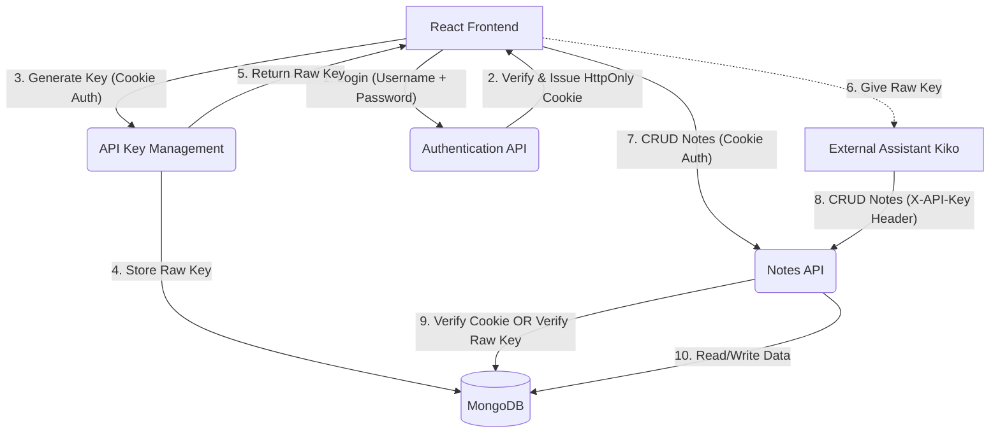
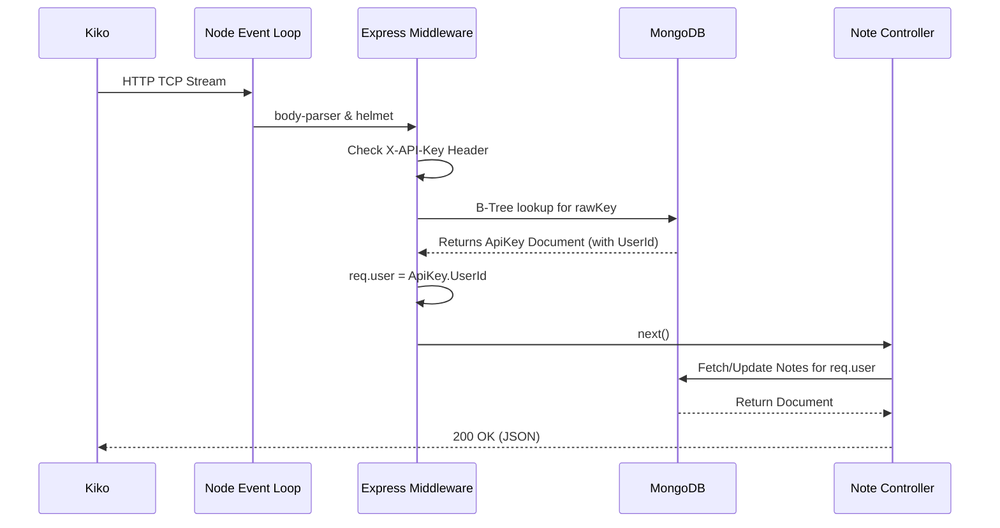

# Notes-Web API Internals & Architecture (Deep Dive)

This document serves as the comprehensive engineering specification for the `notes-web` backend. It deliberately ignores high-level "corporate" architectural diagrams in favor of mechanical realities: how memory, database trees, and network streams actually behave in this application.

## 1. System Architecture & The Express Event Loop

The backend is built on **Node.js, Express, and MongoDB (via Mongoose)**. 

### The Request Lifecycle (Mechanical View)
When an HTTP request hits the Node.js server on port 5000:
1. **TCP Connection**: Node's internal libuv C threadpool handles the TCP connection and emits an event to the V8 JavaScript thread.
2. **Body Parsing (`express.json`)**: Before any controller logic runs, the incoming TCP stream is buffered into memory. If the `Content-Type` is `application/json`, the `body-parser` middleware attempts a synchronous `JSON.parse()`. 
   - *Quirk*: `JSON.parse` is strictly ECMAScript standard. It immediately throws a `SyntaxError: Bad control character` if the incoming payload string contains unescaped physical newlines (`\n`) or tabs (`\t`) inside double quotes. The server drops the request with a 400 status before it ever reaches our routing logic.
3. **Security Check (`helmet` & `cors`)**:
   - `helmet()` automatically injects strict HTTP headers, particularly `Content-Security-Policy: default-src 'self'`. This caused issues for Swagger UI when it attempted to fetch from `localhost:3000` while hosted on `localhost:5000`, as `3000` was not considered `self`.
   - `cors()` intercepts the `Origin` header. We explicitly mapped `127.0.0.1:5000` and `localhost:5000` to prevent the browser from blocking internal API doc requests.

### Routing & Controllers
Instead of monolithic files, we use Express Routers to mount isolated middlewares:
- `/api/v1/auth`: `authRoutes.js` -> `authController.js`
- `/api/v1/notes`: `noteRoutes.js` -> `noteController.js`
- `/api/v1/apikeys`: `apiKeyRoutes.js` -> `apiKeyController.js`

### Data Flow Diagram (DFD)
Below is the Data Flow Diagram illustrating how external entities (the React Client and the external Assistant Kiko) interact with the system.



### Directory Structure (Separation of Concerns)

```text
backend/
├── config/
│   └── db.js                 # MongoDB connection logic
├── controllers/
│   ├── authController.js     # Login/Register logic
│   ├── apiKeyController.js   # Key generation and revocation logic
│   └── noteController.js     # CRUD operations for notes
├── middleware/
│   └── authMiddleware.js     # JWT Cookie and API Key verification
├── models/
│   ├── User.js               # User schema (Username, Password hash)
│   ├── ApiKey.js             # API Key schema (Raw Key, Name, User ref)
│   └── Note.js               # Note schema (Content, User ref)
├── routes/
│   ├── authRoutes.js         # Routes to authController
│   ├── apiKeyRoutes.js       # Routes to apiKeyController
│   └── noteRoutes.js         # Routes to noteController
├── .env                      # Secrets (JWT_SECRET, MONGO_URI)
├── swagger.yaml              # OpenAPI Specification
└── server.js                 # Express bootstrap and middleware mounting
```

---

## 2. Authentication Mechanics

We use a **Dual Authentication System** designed to allow secure frontend browser sessions while giving frictionless API access to programmatic bots (like Kiko). Both mechanisms eventually attach a `req.user` document to the request lifecycle.

### A. First-Party Browser Auth: HttpOnly JWT
Browsers are inherently hostile environments vulnerable to XSS. We do not store tokens in `localStorage`.
1. **Authentication**: `authController.login` compares the plaintext password against the `bcrypt` hash in MongoDB using `bcrypt.compare()`. 
2. **Issue**: If valid, we sign a JSON Web Token with `process.env.JWT_SECRET`. 
3. **Delivery**: The token is returned to the browser in a `Set-Cookie` header marked as `HttpOnly` (invisible to JS) and `SameSite=Strict`. 
4. **Verification**: When the frontend requests notes, `authMiddleware.protectCookie` parses the cookie header, decodes the JWT, does a quick MongoDB `findById()` on the `decoded.id`, and populates `req.user`.

### B. Third-Party Bot Auth: Plaintext API Keys
To allow the user to explore and view API keys multiple times, we opted against cryptographic hashing for API keys (a calculated tradeoff prioritizing local usability over zero-trust enterprise security).
1. **Generation**: `crypto.randomBytes(32)` calls down into the OS's cryptographically secure pseudo-random number generator (CSPRNG) to grab 32 bytes of entropy, stringified as hex.
2. **Storage**: The raw string (e.g., `nw_abc123...`) is stored in MongoDB.
3. **Verification**: `authMiddleware.protectDual` inspects the `X-API-Key` or `Authorization` header. It runs a direct `ApiKey.findOne({ rawKey })` query. If a match is found, the associated user is attached to `req.user`.



---

## 3. Database Mutability & Update Mechanics

The application heavily utilizes MongoDB's ability to mutate existing B-Tree leaf nodes without deleting and recreating documents. 

### Why Updates Don't Duplicate Notes
When a user edits a note in the UI, or Kiko sends a `PUT /api/v1/notes/:id` request, the database does **not** append the new content to the old content. 

The `noteController.updateNote` endpoint utilizes Mongoose's `findOneAndUpdate()`:
```javascript
const note = await Note.findOneAndUpdate(
  { _id: req.params.id, user: req.user._id },
  req.body,
  { returnDocument: 'after', runValidators: true }
);
```
**Mechanism:**
1. MongoDB traverses the `_id` B-Tree index to locate the specific 16-byte ObjectId.
2. It targets the exact memory block holding the `content` string.
3. It completely overwrites the physical string in the database with the new `req.body.content` payload.
4. `{ returnDocument: 'after' }` instructs the MongoDB driver to return the newly mutated document over the network wire, rather than the old cached version.

---

## 4. Rich Text & Markdown Parsing Internals

The UI uses Tiptap (a headless wrapper around ProseMirror) to handle rich text. ProseMirror's internal state machine strictly expects **HTML AST (Abstract Syntax Trees)**.

If Kiko bypasses the UI and posts raw Markdown (e.g., `# Header`) directly to the MongoDB `content` field, the UI would normally crash or render the raw string verbatim because the HTML parser doesn't recognize markdown symbols.

**The Auto-Parse Intercept:**
To fix this mechanically without bogging down the backend:
1. When `RichTextEditor.jsx` mounts, it intercepts the `content` string fetched from MongoDB.
2. It runs a fast heuristic: `!content.includes('<p>') && !content.includes('<h')`.
3. If it detects raw markdown lacking standard HTML block tags, it synchronously funnels the string through `marked.parse(content)`.
4. The resulting HTML string is then safely fed into the ProseMirror engine.

This allows the database to hold either raw Markdown or raw HTML seamlessly.

---

## 5. Database Schemas

**User Schema**
- `username` (String, Unique, Indexed)
- `password` (String, Bcrypt hashed, `select: false` to prevent accidental JSON leaks)

**ApiKey Schema**
- `rawKey` (String, Unique, Indexed) - Stored in plaintext.
- `name` (String) - Identifier.
- `user` (ObjectId, Ref: 'User')
- `lastUsedAt` (Date) - Updated asynchronously inside the auth middleware to track usage.

**Note Schema**
- `title` (String)
- `content` (String) - Stores either raw Markdown or serialized HTML.
- `theme` (String)
- `user` (ObjectId, Ref: 'User') - Enforces multitenancy (users cannot fetch notes belonging to other `_id`s).
